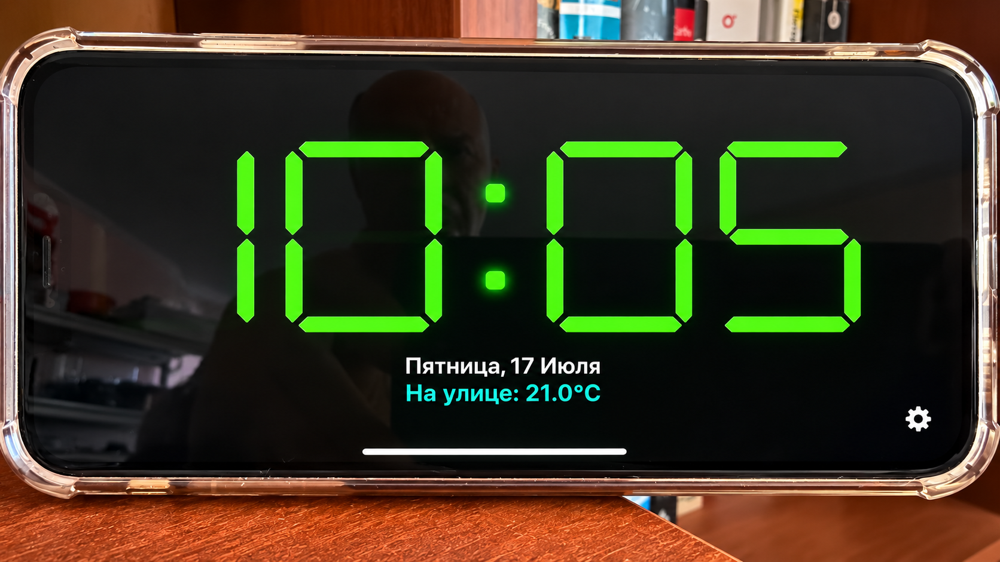
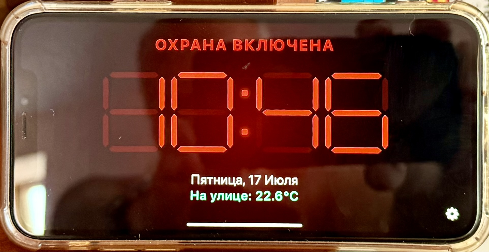

# Home Assistant Clock Panel

Полноэкранная пользовательская панель Home Assistant для iPhone/iPad.

## Landscape mode



## Alarm mode



## Возможности

- время в формате `HH:MM`;
- настоящий семисегментный индикатор, нарисованный CSS;
- постоянно видимые неактивные сегменты;
- мигающее двоеточие;
- текущая дата;
- температура из атрибута `temperature` сущности `weather`;
- режим охраны из бинарного сенсора;
- при включённой охране часы уменьшаются, становятся красными и появляется надпись `ОХРАНА ВКЛЮЧЕНА`;
- адаптация под альбомную и портретную ориентацию;
- учёт safe-area iPhone;
- настраиваемые ширина цифр, расстояние между часами и минутами и толщина сегментов;
- кнопка `Обновить` в левом нижнем углу для перезагрузки панели;
- отсутствие зависимостей от Lovelace, HACS, `button-card` и `card-mod`.

## Файлы

```text
clock-panel/
├── configuration.yaml.example
├── README.md
└── src/
    ├── alarm.js
    ├── clock-panel.js
    ├── clock.js
    ├── clock.css
    ├── segments.js
    ├── utils.js
    └── weather.js
```

## Установка

### 1. Скопировать проект

Скопируйте каталог репозитория в Home Assistant:

```text
/config/www/homeassistant-ui/panels/clock/
```

После копирования основной модуль должен находиться здесь:

```text
/config/www/homeassistant-ui/panels/clock/src/clock-panel.js
```

Home Assistant опубликует его по адресу:

```text
/local/homeassistant-ui/panels/clock/src/clock-panel.js
```

### 2. Зарегистрировать панель

Добавьте в `/config/configuration.yaml`:

```yaml
panel_custom:
  - name: clock-panel
    url_path: clock-screen
    sidebar_title: Часы
    sidebar_icon: mdi:clock-digital
    module_url: /local/homeassistant-ui/panels/clock/src/clock-panel.js
    require_admin: false
    config:
      alarmEntity: binary_sensor.alarm_gateway_alarm_relay_state
      weatherEntity: weather.home_assistant
      armedState: "on"
      locale: ru-RU
      alarmText: ОХРАНА ВКЛЮЧЕНА
      temperaturePrefix: На улице
      digitWidth: 0.9fr
      hourMinuteGap: 42px
      segmentThickness: clamp(16px, 3.1vmin, 34px)
```

Если раздел `panel_custom:` уже существует, добавьте в него только новый элемент списка `- name: clock-panel`.

### 3. Проверить сущности

В **Инструменты разработчика → Состояния** проверьте:

```text
binary_sensor.alarm_gateway_alarm_relay_state
weather.home_assistant
```

У погодной сущности должен быть атрибут:

```yaml
temperature: 18.4
```

Если идентификаторы отличаются, измените их в секции `config`.

### 4. Проверить конфигурацию и перезапустить

В Home Assistant:

```text
Инструменты разработчика → YAML → Проверить конфигурацию
```

Затем выполните полный перезапуск Home Assistant.

### 5. Открыть панель

```text
http://homeassistant.local:8123/clock-screen
```

Панель появится как отдельный раздел верхнего уровня. Её можно выбрать в штатном Kiosk Mode приложения Home Assistant для iOS.

## Настройки

| Параметр | Значение по умолчанию | Назначение |
|---|---|---|
| `alarmEntity` | `binary_sensor.alarm_gateway_alarm_relay_state` | состояние режима охраны |
| `weatherEntity` | `weather.home_assistant` | погодная сущность |
| `armedState` | `on` | состояние, означающее включённую охрану |
| `locale` | `ru-RU` | формат даты |
| `alarmText` | `ОХРАНА ВКЛЮЧЕНА` | текст предупреждения |
| `temperaturePrefix` | `На улице` | подпись температуры |
| `digitWidth` | `0.9fr` | ширина одной цифры; принимает CSS-значение |
| `hourMinuteGap` | `42px` | расстояние между блоками часов и минут; принимает CSS-значение |
| `segmentThickness` | `clamp(16px, 3.1vmin, 34px)` | толщина сегментов; принимает CSS-значение |

Если реле работает инверсно, укажите:

```yaml
armedState: "off"
```

Например, чтобы сделать цифры уже, увеличить центральный промежуток и сегменты:

```yaml
digitWidth: 0.8fr
hourMinuteGap: 56px
segmentThickness: 20px
```

Значения передаются в CSS, поэтому допустимы единицы `px`, `vw`, `vmin`, `fr` и функции `clamp(...)`.

## Обновление после изменения файлов

Приложение Home Assistant и Safari могут кэшировать JavaScript. После обновления файлов:

1. полностью закройте приложение Home Assistant;
2. откройте его снова;
3. при необходимости измените URL модуля, добавив версию:

```yaml
module_url: /local/homeassistant-ui/panels/clock/src/clock-panel.js?v=2
```

## Примечание о шрифте

Файл `DSEG7Classic-Bold.woff2` не требуется: цифры формируются отдельными CSS-сегментами. Благодаря этому неактивные сегменты остаются видимыми и панель не зависит от стороннего файла шрифта.
